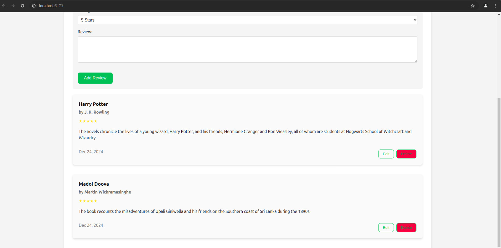
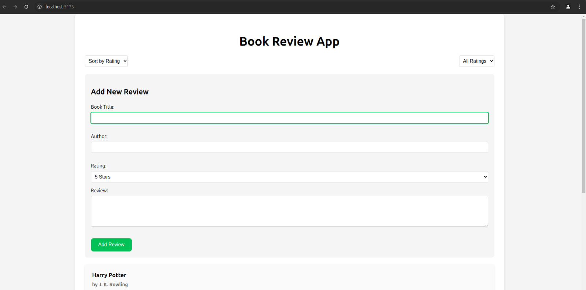

# Book Review Application

A modern web application for sharing and discovering book reviews. Users can browse reviews, add their own, and engage with the book-loving community.

## Features

- **Browse Reviews**: Discover book reviews shared by the community
- **Add Reviews**: Share your thoughts on books you've read
- **Edit & Delete**: Manage your own reviews
- **Rating System**: Rate books on a 1-5 star scale
- **Responsive Design**: Works seamlessly across all devices

## Tech Stack

- **Frontend**: React with TypeScript
- **Styling**: Tailwind CSS
- **Icons**: Lucide React
- **Build Tool**: Vite
- **Database**: MySQL

## Getting Started

### Prerequisites

- Node.js (v18 or higher)
- MySQL Server

### Installation

1. Clone the repository:


2. Install dependencies:


3. Create a `.env` file in the root directory with your MySQL configuration:
```env
DB_HOST=localhost
DB_USER=your_username
DB_PASSWORD=your_password
DB_NAME=book_reviews
```

4. Start the development server:
```bash
npm run dev
```


## Project Structure

```
src/
├── components/        # Reusable UI components
├── hooks/            # Custom React hooks
├── services/         # API and database services
├── types/            # TypeScript type definitions
├── utils/            # Helper functions
└── pages/            # Main application pages
```

## API Endpoints

- `GET /reviews` - Retrieve all book reviews
- `POST /reviews` - Create a new review
- `PUT /reviews/:id` - Update an existing review
- `DELETE /reviews/:id` - Delete a review

## Database Schema

```sql
CREATE TABLE reviews (
  id INT PRIMARY KEY AUTO_INCREMENT,
  book_title VARCHAR(255) NOT NULL,
  author VARCHAR(255) NOT NULL,
  rating INT NOT NULL CHECK (rating >= 1 AND rating <= 5),
  review_text TEXT NOT NULL,
  created_at TIMESTAMP DEFAULT CURRENT_TIMESTAMP
);
```

## Contributing

1. Fork the repository
2. Create your feature branch (`git checkout -b feature/AmazingFeature`)
3. Commit your changes (`git commit -m 'Add some AmazingFeature'`)
4. Push to the branch (`git push origin feature/AmazingFeature`)
5. Open a Pull Request


This template provides a minimal setup to get React working in Vite with HMR and some ESLint rules.

Currently, two official plugins are available:

- [@vitejs/plugin-react](https://github.com/vitejs/vite-plugin-react/blob/main/packages/plugin-react/README.md) uses [Babel](https://babeljs.io/) for Fast Refresh
- [@vitejs/plugin-react-swc](https://github.com/vitejs/vite-plugin-react-swc) uses [SWC](https://swc.rs/) for Fast Refresh




